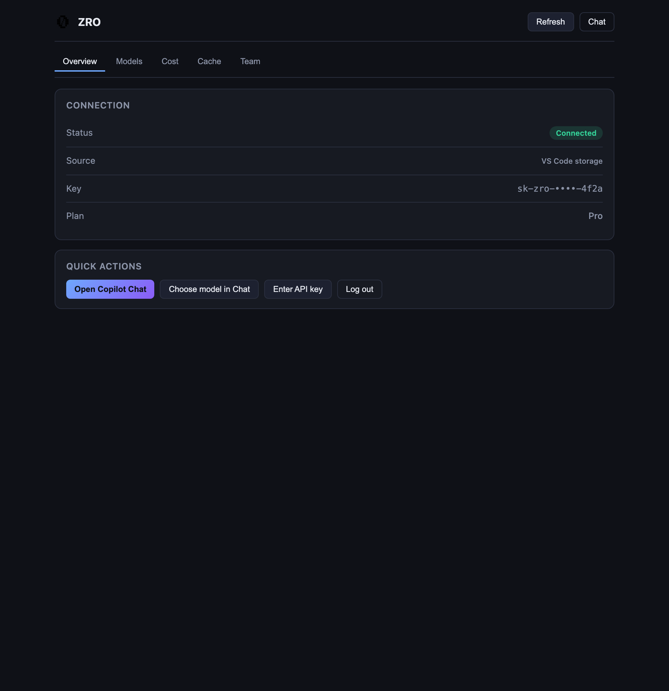
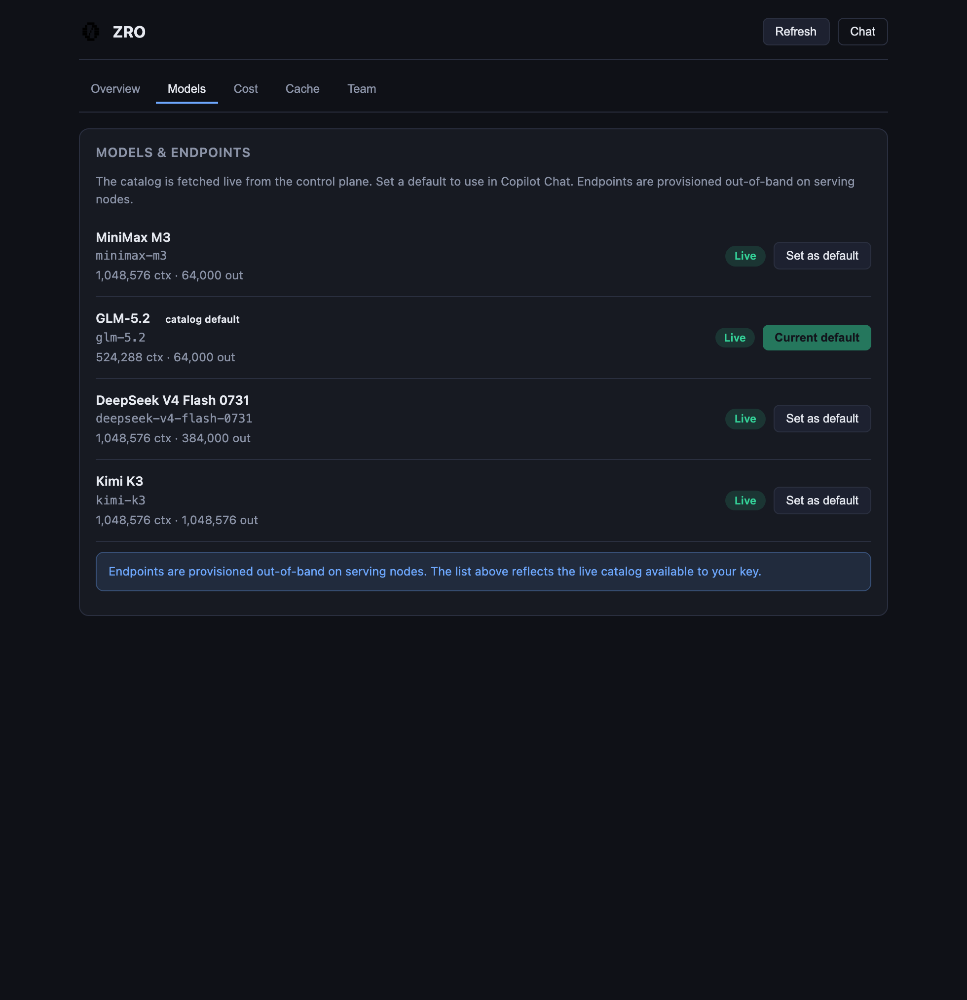
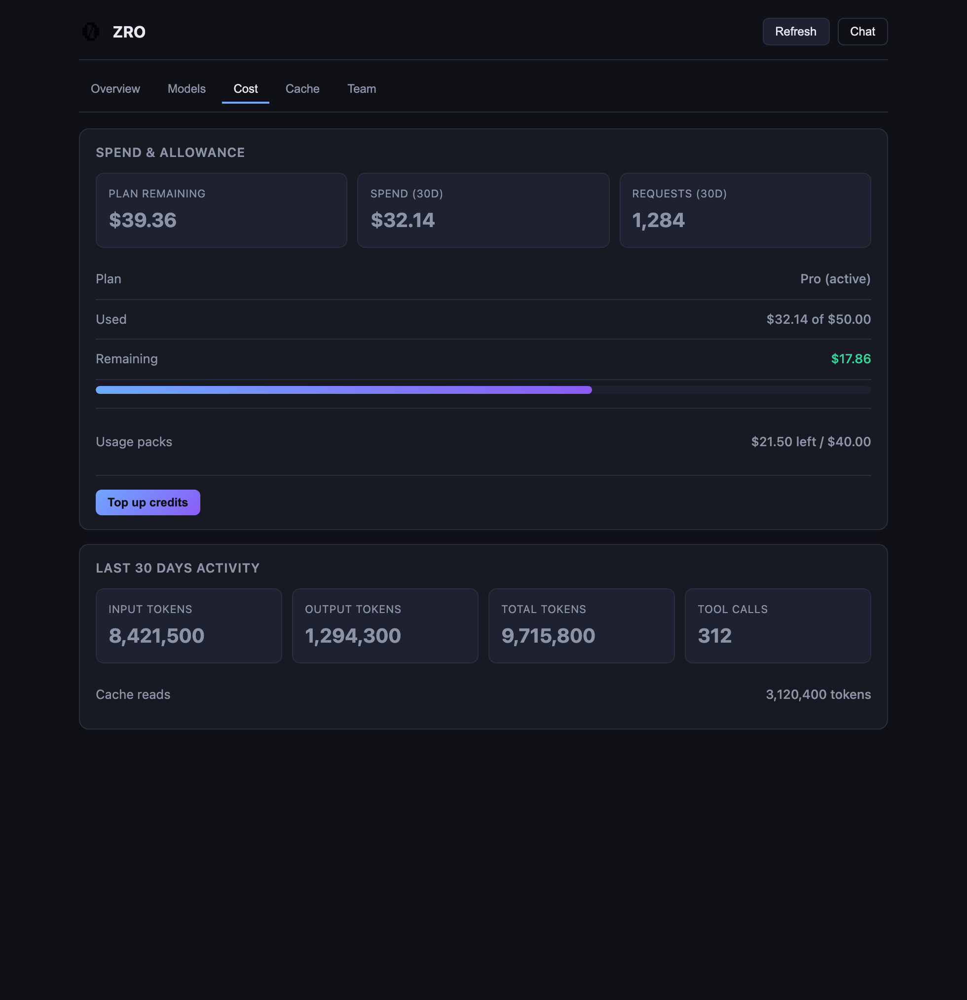
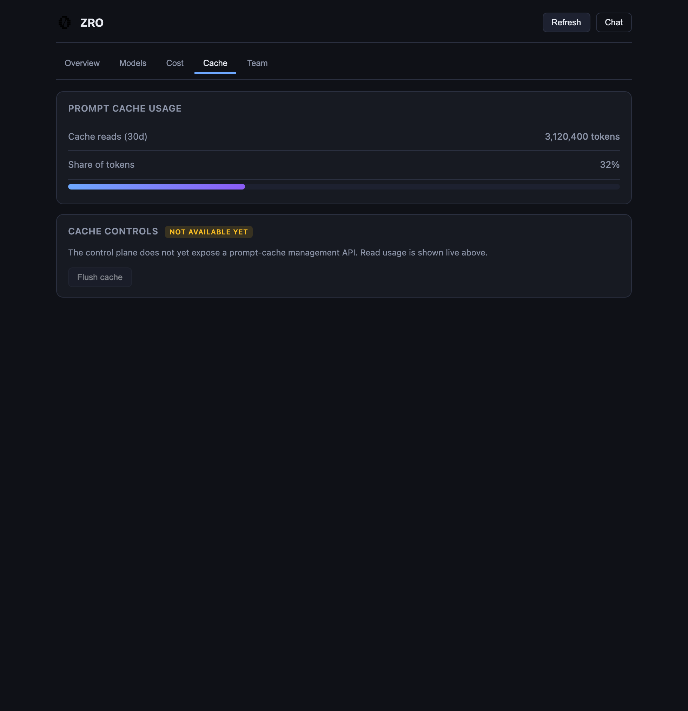
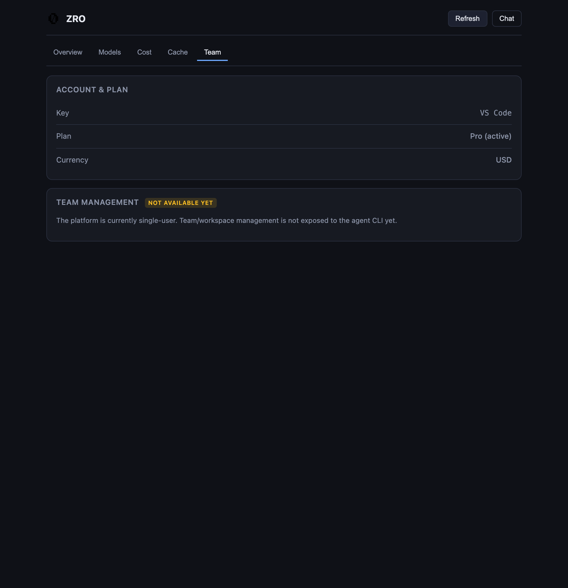

# ZRO for VS Code

Use [ZRO](https://zro.moonmath.ai) models directly inside VS Code's Copilot Chat.

ZRO registers as a first-class language model provider, so its models show up
natively in the Copilot Chat model picker — no proxy, no separate window, no
copy-paste. Pick a model, chat as usual, and responses stream from the ZRO
inference endpoint with full tool-calling support (file edits, terminal, etc.).

## Features

- **Native model discovery** — ZRO models appear in the Copilot Chat dropdown,
  prefixed with `ZRO`. The catalog is fetched live from the control plane on
  every picker refresh, so newly activated models appear automatically — no
  extension update needed.
- **Dashboard panel** — run `ZRO: Dashboard` (or `ZRO: Sign in with browser`)
  from the Command Palette to open a single-panel dashboard with tabs for
  **Overview**, **Models**, **Cost**, **Cache**, and **Team**.
- **Browser sign-in (OAuth)** — start a device-authorization login right from
  VS Code, approve it in your browser, and the API key is stored securely in
  SecretStorage — no copying keys.
- **Cost &amp; usage dashboard** — plan allowance, usage packs, remaining credit,
  and trailing-30-day activity (tokens, requests, spend) fetched live from the
  control plane.
- **Prompt-cache visibility** — cache-read token usage is shown in the Cost and
  Cache tabs (cache *controls* are not exposed by the API yet).
- **Zero-config if you already use the CLI** — the extension reads the same
  `~/.config/zro/credentials.json` file written by `zro login`, so existing users
  are ready to go immediately after install.
- **Reasoning-effort control** — choose how hard reasoning models think
  (`none` / `high` / `max`, per model), globally or per model, from the Command
  Palette, Settings, or the dashboard. See
  [Reasoning effort](#reasoning-effort).
- **Streaming + tool calls** — responses stream token-by-token, and tool calls
  round-trip through Copilot Chat's agent loop just like any built-in model.
- **Resilient fallback** — if the control plane is unreachable, a built-in model
  list keeps the picker populated so you're never left without options.

## Dashboard

Run `ZRO: Dashboard` from the Command Palette to open the dashboard panel. It has five tabs, each covered below.

### Overview



The Overview tab is the landing page. The **Connection** card shows whether the extension is connected to the control plane, where the API key was resolved from (VS Code storage, CLI credentials file, or `ZRO_API_KEY`), the masked key, and the current billing plan. The **Quick actions** card surfaces the most common commands: sign in, enter an API key, set the default model, and refresh the dashboard.

### Models



The Models & endpoints tab lists every model active in the control-plane catalog fetched live on each refresh. Each row shows the model's display name and context window, a **Live** pill confirming it is available on the serving endpoints reachable by your key, and a **Set as default** button to pick the model used by Copilot Chat (the current default shows **Current default**). Endpoints are provisioned out-of-band on serving nodes, so there is no separate endpoints list.

Models that support reasoning also get an **Effort** dropdown (see [Reasoning effort](#reasoning-effort)), with a pill showing whether the active value comes from a per-model override, the global setting, or the server default. The **Reasoning effort** card above the list sets the global level for all models.

### Cost



The Cost tab shows billing and spend at a glance: plan allowance, usage-pack credits, and total remaining credit, plus trailing-30-day activity — requests, tool calls, input/output tokens, cache-read tokens, and spend. A **Top up credits** button opens the account top-up page in your browser.

### Cache



The Cache tab isolates prompt-cache usage from the rest of cost. It shows cache-read input tokens over the trailing 30 days as a share of total input — a quick read on how much the cache is saving. The API does not yet expose cache controls, so only observed usage is shown.

### Team



The Team tab shows account-level team information when your plan includes shared access — members and the shared plan/credit pool. For individual accounts it confirms the account holder and plan.

## Install

### From a .vsix

```bash
code --install-extension zro-0.1.0.vsix
```

Or in VS Code: Extensions → `…` → *Install from VSIX…*.

## Authenticate

Pick one — all three use the same credential resolution order:

1. **Sign in with browser** — run `ZRO: Sign in` (`zro.login`). VS Code starts a
   device flow, opens your browser, and stores the resulting key securely once
   you approve.
2. **Already logged in via the CLI** — run `zro login` once. The extension reads
   the same `~/.config/zro/credentials.json` file, so no further setup is needed.
3. **From VS Code** — run the `ZRO: Enter API key` command from the Command
   Palette and paste a ZRO API key. It is stored in VS Code's SecretStorage.
4. **For CI / power users** — set the `ZRO_API_KEY` environment variable. It
   takes precedence over the other two.

## Use

1. Open Copilot Chat (`⌘⇧I` / `Ctrl+Shift+I`).
2. Pick a model from the dropdown — ZRO models are prefixed with `ZRO`.
3. Chat as usual. Responses stream from the ZRO endpoint; tool calls (file edits,
   terminal, etc.) round-trip through Copilot Chat's agent loop.

That's it. Once authenticated, every ZRO model active in the control plane is
available with no additional configuration.

## Reasoning effort

ZRO models that support reasoning let you choose how hard they think before
answering — trading latency for quality.

Set it from any of:

- **Model picker → the model's own Thinking Effort control** — each reasoning
  model keeps a single row in the model list, and that model's levels are exposed
  on that row (not as duplicate rows). Where exactly you see it depends on the
  picker your VS Code renders:
  - **New model picker** (`chat.experimentalModelPicker` enabled): hovering a
    model row expands the model's card, which has a **Thinking Effort** section
    rendered as a segmented control (`No thinking` / `High` / `Max`, …), and the
    chat input's model button appends the active level to its label.
  - **Classic picker**: the control sits in the chat input beside the model name,
    showing the active level and opening the level list when clicked.
- **Command palette** → **`ZRO: Set reasoning effort`**, then pick a model (or
  *Global default*) and a level.
- **Dashboard → Models tab** — every reasoning model row has an **Effort** chevron
  that opens a submenu of *that model's* levels (label, description, and a check on
  the active one), plus *Default* to hand the choice back to the control plane. A
  pill next to it shows whether the level comes from the model, a per-model
  override, or the server.
- **Settings** → `zro.reasoningEffort` (all models) and
  `zro.reasoningEffortByModel` (per model).
- **Manage Models** (Settings → Language Models) — right-click a ZRO model for a
  **Thinking Effort** submenu, as core renders any model's configuration schema
  there.

For example, to make GLM-5.2 skip reasoning (fastest) while Kimi K3 stays on its
full setting:

```jsonc
{
  "zro.reasoningEffort": "default",
  "zro.reasoningEffortByModel": {
    "glm-5.2": "none"
  }
}
```

Precedence is **row dropdown choice → per-model override → global setting → the
model's native default**. `default` means "send nothing", so the control plane
applies the level it recommends. A level a model doesn't support falls back to
that model's default rather than erroring. The change applies to the next message
you send.

## Configuration

| Setting | Purpose | Default |
| --- | --- | --- |
| `zro.reasoningEffort` | Reasoning effort for all ZRO models | `default` |
| `zro.reasoningEffortByModel` | Per-model overrides, keyed by model id | `{}` |
| `ZRO_API_KEY` (env) | API key — overrides everything else | — |
| `ZRO_ENDPOINT_ROOT` (env) | Inference + catalog endpoint root | `https://zro.moonmath.ai` |

## Use with Cline, Continue, and Roo Code

ZRO also works inside other AI-coding extensions. Run the
**`ZRO: Configure in other extensions`** command — it detects which of
Cline, Continue, and Roo Code are installed and walks you through wiring
them up.

- **Cline** and **Roo Code** can use ZRO models with no second API key via
  their **"VS Code Language Model API"** provider, because ZRO already
  registers as a VS Code language model provider. The command opens the
  right settings screen and shows the exact steps. It also offers to
  generate an OpenAI-compatible profile (base URL + API key + model ID)
  for users who prefer that provider type.
- **Continue** is configured by merging ZRO model entries into
  `~/.continue/config.yaml` (or `config.json`), replacing any previous
  `ZRO ` entries. Your API key is written to that file in plaintext, so
  the command asks for confirmation first.

## Notes

- The model catalog is fetched live from the control plane's `/api/cli/models`
  endpoint on every picker refresh, filtered to the models currently active in
  LiteLLM. If that fetch fails, a built-in fallback list is used so the picker is
  never empty.
- Reasoning-effort choices — from the model's **Thinking Effort** control (the
  model card's segmented control in the new model picker, or the chat input's
  level button in the classic picker) or ZRO's own settings — are sent as
  `reasoning_effort` on each request; see [Reasoning effort](#reasoning-effort).
  On builds that render neither, the ZRO settings still apply.
- The per-model control comes from the model's `configurationSchema`
  (`group: "navigation"`, the group VS Code reserves for thinking effort). It is
  internal/undocumented API: if a future build renames it, the control disappears
  and the ZRO settings remain the fallback.
- A level a model doesn't support is clamped to that model's default rather than
  rejected, so a global setting is always safe to apply.
- Image input is not advertised (`imageInput: false`).
